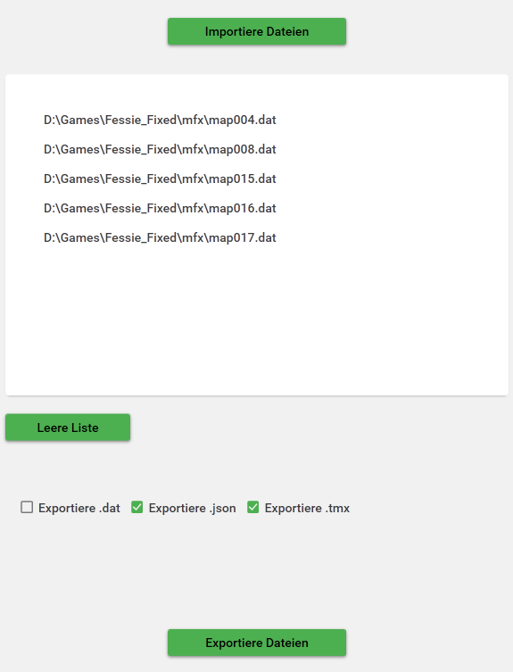
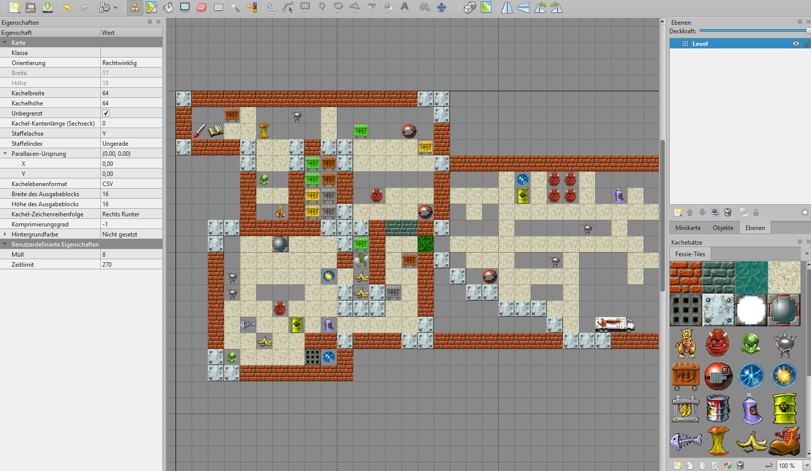

# FLC - Fessie Level Converter
Dies ist ein minimales Programm, zum konvertieren von Level-Dateien von dem PC-Spiel "Fessie räumt auf".
Für mich war das ein privates Anliegen, Level editieren zu können. Deswegen stelle ich das hier zur Verfügung.

Der Fessie Level Converter konvertiert zwischen den Orginalen Level-Dateien `.dat`, lesbarerem `.json` Format und eingeschränkt dem `.tmx` Format vom Tiled Editor 1.11.2.
Im JSON-Format lassen sich die Level relativ easy einsehen (Struktur der Level ist weiter unten beschrieben).
Vorallem aber um die Editierbarkeit größerer Level einfacher zu gestalten, hielt ich wenigstens die Anbindung zum Tiled Editor für angebracht.

## Verwendung
Denkt dran, von den Orginalen Leveln eine Backup-Kopie zu machen. Wenn sie mal überschrieben sind, müsst ihr euch selbst die Orginallevel besorgen.

1. Die neueste Version unter Releases downloaden.
2. Die Exe `FessieLevelConverter.exe` und das Tileset `Fessie-Tiles.tsx` **unbedingt zusammen** extrahieren/ablegen.
Wird das Tileset nicht neben der Exe abgelegt, wird der Export nach `.tmx` deaktiviert.
3. Die Exe Starten.
    - Gewünschte Dateien importieren. Die Fessie-Level-Dateien findet ihr unter `<Installations-Verzeichnis>/mfx/map003.dat` bspw. für das 4. Level.
    - je nach Bedarf die Häkchen unten bei den Export-Formaten ankreuzen (`.dat`, `.json`, `.tmx`).
    - Und Exportieren klicken. Hier dürft ihr den Ordner auswählen, wohin alle gelisteten Dateien exportiert werden.
    Das Spiel sucht auch nur nach Levelnamen die `mapXXX...` heißen. Ihr könnt also bestehende Level ersetzen oder neue Level ganz hinten anhängen.

## Anleitung: Level Bearbeiten mit dem Tiled Editor 1.11.2.

1. Installiert den Tiled Editor 1.11.2 und öffnet ein Level Eurer Wahl (`.tmx`).
2. Unter Karte > Karteneigenschaften kann das `Zeitlimit` und die Anzahl an benötigtem `Müll` editiert werden.
3. In der Mitte kann mithilfe des Tilesets nach belieben Tiles gezeichnet werden oder Monster gesetzt werden. Verwendet den Radiergummi, um Tiles zu löschen.
Fessie sollte nur einmal vorkommen. Braune Müllcontainer wechseln im Spiel ihre Farbe zufällig, die anderen Müllcontainer behalten ihre Farbe.
4. Abspeichern, wieder durch den Converter jagen (`.tmx` -> `.dat`) und als Level für das Fessie-Spiel hinterlegen.

## Anleitung: Selbst ein Level erstellen mit dem Tiled Editor 1.11.2.
Die Karte muss ein spezifisches Format haben, der Converter kommt nur mit vielen Annahmen zurecht. Am Besten ihr richtet Euch nach den Beispiel-Leveln in diesem Repo.
1. Wählt Neu > Neue Karte
2. Orientierung Rechtwinklig, Kachelebenenformat CSV, Kachel-Zeichenreihenfolge rechts-runter, Kachelgröße 64x64 Pixel, Kartengröße Unbegrenzt.
3. Unter Karte > Karteneigenschaften sollte der int `Zeitlimit` und der int `Müll` hinterlegt sein. Der Converter sucht sich sonst Werte für Euch aus.
4. Der **Name** der Kachelebene muss `Level` sein.
5. Importiert das Tileset falls nicht schon geschehen. Dann seid ihr Good-To-Go.
6. Nach dem Editieren wieder durch den Converter jagen (`.tmx` -> `.dat`) und als Level für das Fessie-Spiel hinterlegen.

## Level-Struktur
Die Daten der Levels bestehen ausschließlich aus 32-bit Integern (Little Endian), das macht sie einfach zu parsen.

### Level-Datei
|  Datentyp | Beschreibung | Beispiel |
| ---| --- | --- |
| int32  | Zeitlimit für das Level, in Sekunden  | 270 |
| int32  | Erforderliche Müll-Anzahl für das Level  | 12 |
| int32  | Breite des Levels in Anzahl Tiles | 20 |
| int32  | Höhe des Levels in Anzahl Tiles | 15 |
| int32[]  | Liste an Wand-IDs. Diese ist exakt **Breite*Höhe** groß. Sie beschreibt für jedes Tile, welche Wand-ID an der Stelle kommt. Sie läuft von links nach rechts, oben nach unten. Ein Mapping der IDs findet ihr in  | [0, 0, 5, 5, 6, 6, 2, 4, 0, ...] |
| int32  | Anzahl an Entities in dem Level. Die Größe der nachfolgenden Entity-Liste. | 2 |
| Entity[]  | Liste an Entities, die in dem Level verteilt sind. | [0, 2, 7, 1, 3, 8] |

### Entity
Eine Entity besteht immer aus 3 Zahlen, die ihre ID und Position im Level beschreibt. Fessie hat z.B. eine ID von 0, Müll-Monster eine 1.

|  Datentyp | Beschreibung | Beispiel |
| ---| --- | --- |
| int32  | ID der Entity | 0 |
| int32  | X-Index des Tiles der Entity | 2 |
| int32  | Y-Index des Tiles der Entity | 7 |

## Bug-Reports und Feedback
Ihr seid immer willkommen, ein Github-Issue aufzumachen, dem Repo beizutragen oder mir eine Nachricht zu schreiben.